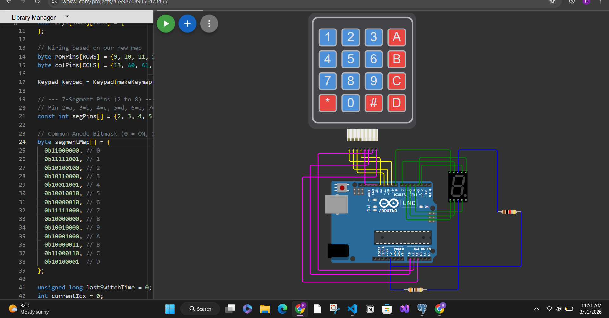

# IoT Labs

This repository contains two Arduino-based IoT lab exercises focused on digital input handling and output control.

## Repository Structure

```text
IOT-Labs/
	README.md
	lab1/
		readme.md
		task1.ino
	lab2/
		readme.md
		task2.ino
```

## Labs Overview

1. `lab1`: 8-key summing tone generator.
2. `lab2`: 4x4 keypad to 7-segment display interface.

## Visual Previews

Add real setup photos and short demo videos so readers can quickly understand each lab.

### Lab 1 Preview


### Lab 2 Preview



If you host videos on YouTube, replace the links above with YouTube URLs.

## Requirements

- Arduino IDE 2.x (or Arduino CLI)
- An Arduino-compatible board (for example Arduino Uno)
- USB cable for uploading sketches
- Breadboard and jumper wires

## How To Use This Repository

1. Open the Arduino IDE.
2. Load the sketch for a specific lab:
	 - `lab1/task1.ino`
	 - `lab2/task2.ino`
3. Wire the circuit exactly as described in that lab's `readme.md`.
4. Select board and serial port.
5. Upload and test.

## Suggested Lab Workflow

1. Read each lab objective and expected behavior first.
2. Build the circuit carefully and double-check wiring.
3. Upload the code without changing pin mappings initially.
4. Verify expected behavior.
5. Modify timing, mappings, or display behavior and note observations.

## Troubleshooting (General)

- If upload fails, verify board/port selection and cable quality.
- If behavior is unstable, check for loose ground or power connections.
- If inputs behave inverted, confirm `INPUT_PULLUP` logic (pressed = `LOW`, released = `HIGH`).
- If outputs are blank or incorrect, verify each pin-to-component mapping one by one.

## Safety Notes

- Do not power speakers directly from high-current sources.
- Use common ground across all modules.
- Disconnect USB power while rewiring.

## Deliverables (Recommended)

For each lab, keep:

- A wiring photo or diagram
- The final uploaded sketch
- Short test notes: what worked, what failed, and how it was fixed

## Media Folder Convention

Use this structure for images and videos:

```text
IOT-Labs/
	media/
		lab1/
			lab1-setup.jpg
			lab1-demo.mp4
		lab2/
			lab2-setup.jpg
			lab2-demo.mp4
```

## License

Use this repository for educational and lab practice purposes.
