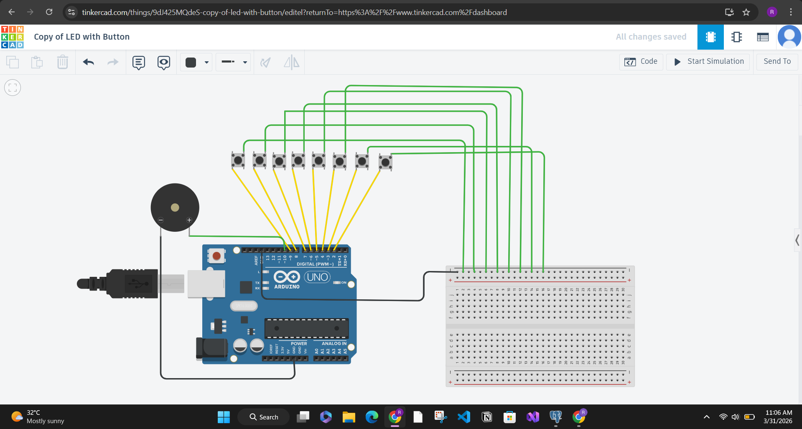

# Lab 1: 8-Key Summing Tone Generator

## Objective

Build a simple multi-button sound interface where each button contributes a unique frequency. When multiple buttons are pressed together, the program sums their frequencies and plays the combined value on a speaker.

## Learning Outcomes

By completing this lab, you will practice:

- Reading multiple digital inputs using `INPUT_PULLUP`
- Detecting button press edges (new press events)
- Implementing a minimum tap duration window using `millis()`
- Generating tones with Arduino `tone()` and stopping with `noTone()`

## File

- Sketch: `task1.ino`

## Media Preview

Add these files so this section renders automatically:

## Hardware Required

- Arduino Uno (or compatible)
- 8 push buttons
- Passive buzzer or small speaker
- Breadboard and jumper wires

## Pin Mapping

### Buttons

Buttons are connected to digital pins with internal pull-up enabled.

- Button 1 -> Pin 2
- Button 2 -> Pin 3
- Button 3 -> Pin 4
- Button 4 -> Pin 5
- Button 5 -> Pin 6
- Button 6 -> Pin 7
- Button 7 -> Pin 8
- Button 8 -> Pin 9

Each button should connect between the assigned input pin and GND.

### Speaker

- Speaker/Buzzer signal -> Pin 10
- Speaker/Buzzer ground -> GND

## Frequency Mapping

Each button contributes one frequency:

- Pin 2 -> 300 Hz
- Pin 3 -> 400 Hz
- Pin 4 -> 500 Hz
- Pin 5 -> 600 Hz
- Pin 6 -> 700 Hz
- Pin 7 -> 800 Hz
- Pin 8 -> 900 Hz
- Pin 9 -> 1000 Hz

If two or more buttons are active, the sketch adds their frequencies and plays the sum.

Example:

- Press button on pin 2 and pin 5 -> $300 + 600 = 900$ Hz

## Program Logic Summary

1. Initialize all button pins as `INPUT_PULLUP`.
2. Track previous button state in `lastState[]`.
3. On transition from released to pressed, set a 20 ms hold window using `tapEndTime[]`.
4. Treat a button as active if:
	 - it is currently pressed, or
	 - current time is still inside its 20 ms tap window.
5. Sum all active-button frequencies.
6. Call `tone(10, totalFrequency)` if sum > 0; otherwise `noTone(10)`.
7. Delay 5 ms each loop for light debouncing.

## Why the 20 ms Tap Window Matters

Very quick taps can be missed in standard polling loops. The 20 ms extension ensures short taps still create a reliable tone event.

## How To Run

1. Open `task1.ino` in Arduino IDE.
2. Connect hardware exactly as in the pin map.
3. Select board and COM port.
4. Upload sketch.
5. Press one or more buttons and listen for output changes.

## Test Checklist

- Press and hold a single button -> steady assigned tone.
- Tap quickly (< 20 ms) -> audible tone still triggers briefly.
- Press multiple buttons -> tone pitch changes based on summed frequency.
- Release all buttons -> sound stops immediately.

## Common Issues and Fixes

- No sound:
	- Check speaker wiring to pin 10 and GND.
	- Confirm component is a buzzer/speaker type compatible with `tone()`.
- Tone always active:
	- Verify button wiring to GND (not 5V) when using `INPUT_PULLUP`.
- Wrong frequency response:
	- Re-check button-to-pin mapping.
- Unstable behavior:
	- Ensure all grounds are common and wires are firmly seated.

## Extension Ideas

- Add LED indicators for active buttons.
- Add serial output showing current summed frequency.
- Replace linear frequencies with musical note frequencies.

